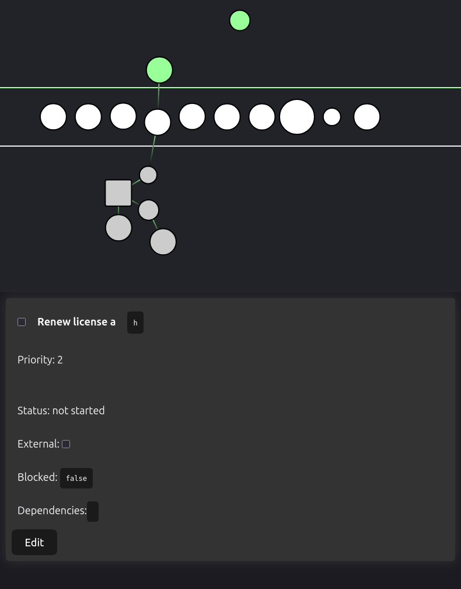

# Task Tree

I'm building this project to have a tool that models my to-do list in a way that
mirrors my mental model. To-do lists are always built as lists, but I think this
is a narrow view of goal-reaching. Every to-do list I have is built to get me
closer to some goal, and the reason I haven't reached that goal yet is that
there is another task waiting for me. I see these tasks as a tree of
dependencies, and that's what the task tree symbolizes.

It's built with D3-force and React on the frontend, with a backend coming soon
in Python and SQL. See [TODO.md](TODO.md) for upcoming features, including a
public alpha deployment.
